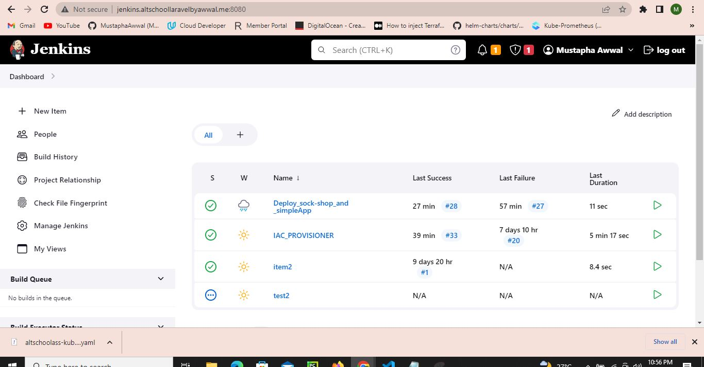
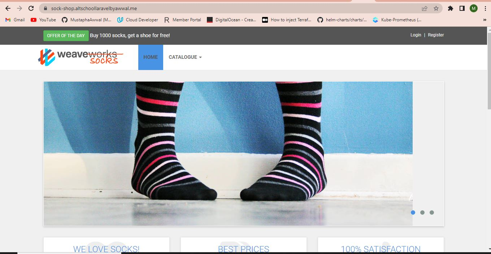
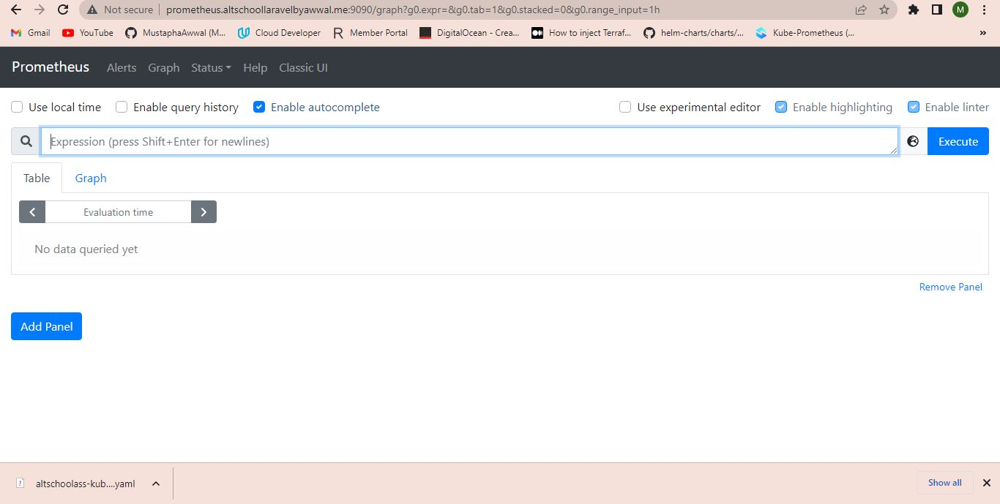

# Altschool3sProject

This repository contains the project assigned for the third-semester examination at Altschool. The objective of the project is to provision a web application with an nginx/httpd frontend proxy and a backend database (MongoDB, PostgreSQL, etc.). Additionally, it involves provisioning the Socks Shop example microservice application and fulfilling specific task instructions.

## Task Instructions

- Deploy everything using an Infrastructure as Code approach.
- Utilize Prometheus as the monitoring tool.
- Choose either Ansible or Terraform as the configuration management tool.
- Ensure the application runs on Kubernetes.
- Enable HTTPS with a Let's Encrypt certificate.

## Deployment Files

- Sock Shop: `K8deployment/deploy/kubernetes/complete-demo.yaml`
- Web Application: `K8deployment/simple-webapp.yaml`

## Screenshots

Please find below the screenshots of various components:

1. Jenkins Successful Build Interface:

2. Sock Shop Application UI:

3. Simple Webapp UI:

4. Prometheus Pod Running:

For additional screenshots, please refer to the `screenshots` directory in the repository. It includes screenshots of different namespaces, such as running pods in each namespace and the monitoring namespace.

Feel free to explore the repository and use the provided deployment files to set up the project environment.

## Contributions

Contributions are welcome! If you encounter any issues or have suggestions for improvements, please feel free to open an issue or submit a pull request.

