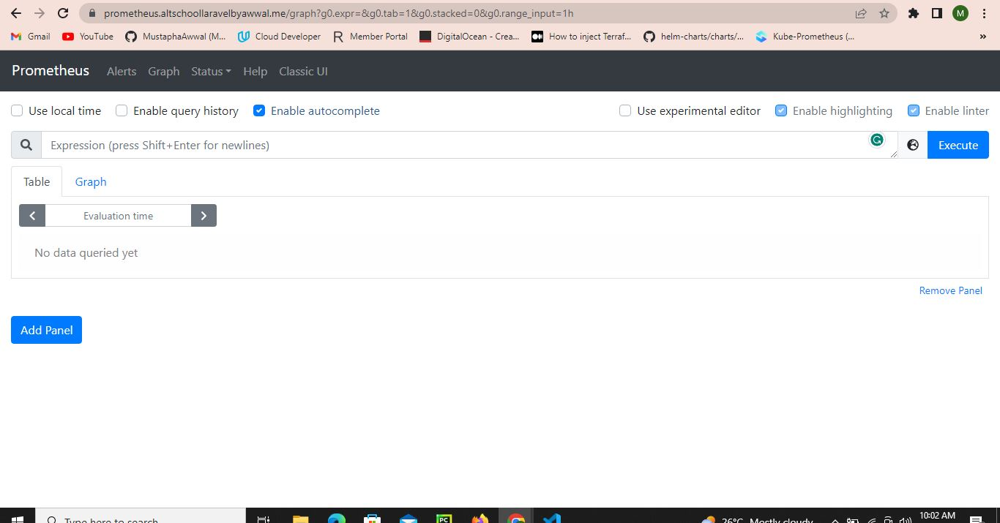

# Altschool3sProject

This repository contains the project assigned for the third-semester examination at Altschool. The objective of the project is to provision a web application with an nginx/httpd frontend proxy and a backend database, along with the deployment of the Socks Shop example microservice application.

## Project Summary

- Provision a webapp of your choosing with nginx/httpd frontend proxy and a database (mongo, postgresql, etc.) backend.
- Provision the Socks Shop example microservice application - [Socks Shop Demo](https://microservices-demo.github.io/).
- Deploy everything using an Infrastructure as Code approach.
- Use Prometheus as a monitoring tool.
- Use Ansible or Terraform as the configuration management tool.
- Run the application on Kubernetes.
- Enable HTTPS with a Let's Encrypt certificate.

## Deployment Files

- For the sock-shop: `K8deployment/deploy/kubernetes/complete-demo.yaml`
- For the web application: `K8deployment/simple-webapp.yaml`

## Screenshots

The following screenshots are available in the `./screenshots` directory of this repository:

1. Jenkins Successful Build Interface:

2. Sock Shop Application UI:

3. Simple Webapp UI:

4. Prometheus Pod Running:

Please note that additional screenshots, such as the running pods in each namespace and the monitoring namespace, can be found in the `./screenshots` directory.

## Infrastructure Provisioning

The infrastructure for this project was provisioned using Terraform. The corresponding Terraform files can be found in the `Terraform` directory of this repository.

## Jenkins Pipeline

The Jenkinsfile for this project, which defines the Jenkins pipeline, can be found in the `Jenkinsfile` directory.

Please feel free to explore the repository for more details and documentation related to the project.

